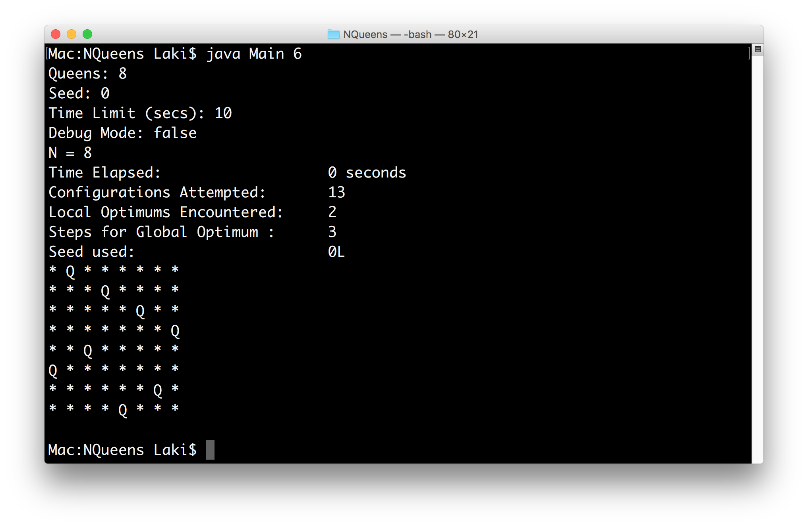

# N-Queens-Problem
Placing N chess queens on an NxN chessboard so that no two queens threaten each other.

The following is a description of the different algorithms used to solve this problem and their results. Each algorithm was tested on my Dell Latitude laptop.

# Algorithms Used

## Naive Blind Search
A brute force algorithm that tries every single possible combination of queens on the board while maintaining the constraint of one queen per location.

The largest board that this algorithm can solve in under 20 seconds is n = 6. This takes 2 seconds and ~450,000 attempts.

## Completely Random Search
Places queens on the board one by one at random locations. If a queen is placed on an invalid spot (on top of another queen or on a threatened spot) then clear the board and try again from the beginning. 

The largest board that this algorithm can solve in under 20 seconds is n = 7. This takes 0 seconds and ~330,000 attempts.

## Intermediate Blind Search
Similar to the Naive Blind Search but instead of trying every single possible position, it limits each queen to its own column.

The largest board that this algorithm can solve in under 20 seconds is n = 8. This takes 13 seconds and ~1,500,000 attempts.

## Advanced Blind Search
Similar to the Naive Blind Search but instead of trying every single possible position, queens are only placed on valid positions. This means positions that are not under attack.

The largest board that this algorithm can solve in under 20 seconds is n = 17. This takes 2 seconds and ~20,000 attempts. It reached a local optimum ~5,000 times and had to restart from scratch by clearing the board. It took 6 steps to reach the global optimum from the last time the board was cleared.

## Iterative Repair
Initializes the board by putting n queens on the diagonal. Moves the queen with the most queens attacking it to the safest position in the same column (to the position with the least amount of queens attacking it). If it gets stuck at a local optimum, it scraps the board and generates a new board with each queen placed on a random unique row in its own column. Then it repeats the process.

The largest board that this algorithm can solve in under 20 seconds is n = 19. This takes 1 second and ~26,000 attempts. It reached a local optimum 6000 times. It took 6 steps from a board restart to the global optimum.

## Randomness with Propagation
Places queens on the board one by one at random locations that are valid (locations that do not already contain a queen on them and are safe). When there are no more valid spots left, check how many queens are on the board. If there are not n queens on the board, clear the board and try again.

The largest board that this algorithm can solve in under 20 seconds is n = 49. This takes 3 seconds and ~16,000 attempts.

## Population Based Search
Initialize the board by putting n queens on the diagonal. Generate 10 child boards that are clones of the parent. For each child, move all the queens that are being attack to a completely safe location on the same column. If such a location does not exist, move it to a random location on the same column. Find the child with the least amount of threatened queens (this is the same heuristic used in the Iterative Repair algorithm) and repeat the process until a solution is found.

This algorithm takes more "steps" to travel to the global optimum than the Iterative Repair Algorithm but it is much faster since it is very unlikely to get stuck on a local optimum and have to restart. This significantly reduces the total number of configurations attempted, and thus reduces the total time.

The largest board that this algorithm can solve in under 20 seconds is n = 100 and it can solve n = 150 in about 20 seconds on particular seeds. The n = 100 solution takes 0 seconds and 7 attempts. It reach the global optimum on the first run, so it encountered 0 local optimums.

## Explicit Solution
Uses a formula to calculate where to put the Queens.

The solution for n = 1000 can be found in 6 seconds.

The solution for n = 2000 can be found in 44 seconds.

# Summary
This table displays the largest board (and number of queens) that each algorithm can solve in under 20 seconds.

| Algorithm                   | Queens| Time Elapsed | Configurations Attempted | Local Optimums | Steps to Global Optimum |
| --------------------------- | -----:|-------------:|-------------------------:|---------------:|------------------------:|
| Naive Blind Search          |     6 |            2 |                 ~450,000 |            N/A |                     N/A |
| Completely Random Search    |     7 |            0 |                 ~330,000 |            N/A |                     N/A |
| Intermediate Blind Search   |     8 |           13 |               ~1,500,000 |            N/A |                     N/A |
| Advanced Blind Search       |    17 |            2 |                  ~20,000 |            N/A |                     N/A |
| Iterative Repair            |    19 |            1 |                  ~26,000 |          6,000 |                       6 |
| Randomness with Propagation |    49 |            3 |                  ~16,000 |            N/A |                     N/A |
| Population Based Search     |  ~100 |            0 |                        7 |              1 |                       7 |
| Explicit Solution           | 1000+ |            0 |                        1 |            N/A |                     N/A |

# Usage
```

Usage: 
	java Main [integer from 0 to 7]

Parameters: 
	0 - random search
	1 - semi-random search
	2 - naive blind search
	3 - intermediate blind search
	4 - advanced blind search
	5 - iterative repair
	6 - population based search
	7 - explicit solution

Examples: 
	java Main 1
	java Main 6
  
```

# Sample Run

Q represents a queen. Dashes represent an empty location. Stars represents a threatened location.


